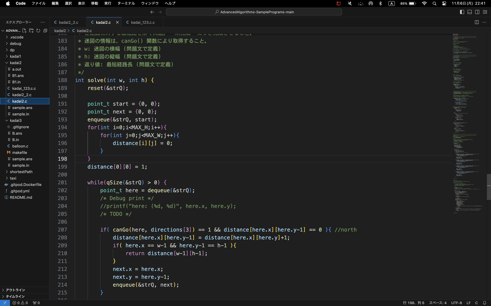

# gitのREADME.md

# 1 見出し
***

## 見出し

# 2 Markdown記法
***

普通の文章です．*斜体*です．**太字**です．***合わせ技***です．
`インラインコード`です．`r 1+2`は3です．
~~打ち消し~~です．

> 引用です．

以下水平線です．

---

***

–––

# 3 表とリスト
***

## 3.1 表
|header1|header2|
|-|-|
|a|b|
|c|d|

|header1|header2|header3|
|:-|-:|:-:|
|a|b|c|
|d|e|f|

## 3.2 リスト

* 普通のリスト
    * リスト1
    * リスト2

- 普通のリスト
    - リスト1
    - リスト2

1. 番号付きリスト
    1. リスト1.1
    1. リスト1.2
1. リスト2
1. リスト3

# 4 画像とリンク
***
[文字](urlや画像)
[Apple](https://www.apple.com/jp/)

[]
(https://www.apple.com/jp/)
